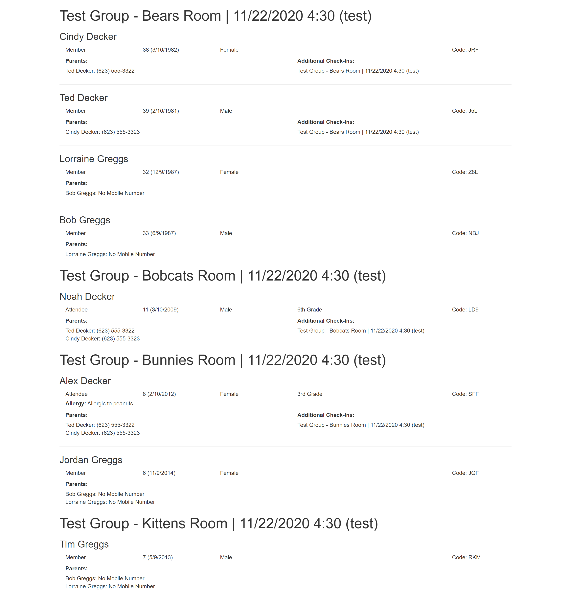

# Attendance Report

*Tested/Supported in Rock version: 10.2-11.3  
*Released: 12/1/2020  

## Summary

This block will display attendance for check-in to aid in printing out rosters/reports quickly and easily.

Quick Links:
- [What's New](#whats-new)
- [Configuration](#configuration)

## What's New
---
- Released v1

## Configuration
---

**Attendance Report Block**

The block will need to be manually added to wherever you wish for it to be used. Such as a new page Check-in > Attendance Report.

*Preview*


*Settings*


```
    Name: Block name

    Default Check-in Group Type: The default Check-In Configuration when the page loads.

    Schedule Category(s): The optional schedule categories that should be included as an option to filter attendance for. If a category is not selected, all schedules will be included.

    Show Campus Filter: Flag indicating if you wish to show the campus filter and column in the block.
   
    Default Campus: An optional default campus to set filter groups.
   
    Enable Grid Row Selection: If you wish to filter down your selection for export or your merge template you can enable this, default is yes.
    
```

**Merge Templates**

A sample merge template is included in "~/Plugins/rocks_kfs/Checkin/AttendanceReports", it will need to be registered in your General Settings > Merge Templates (~/page/370)

*Preview*



*Settings*


