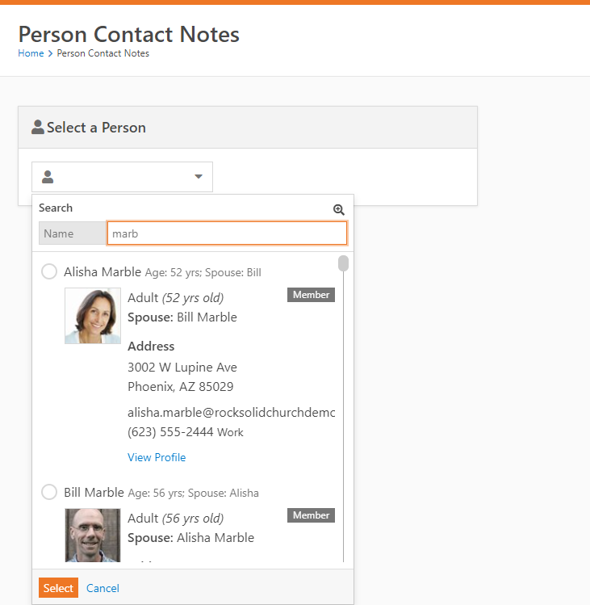
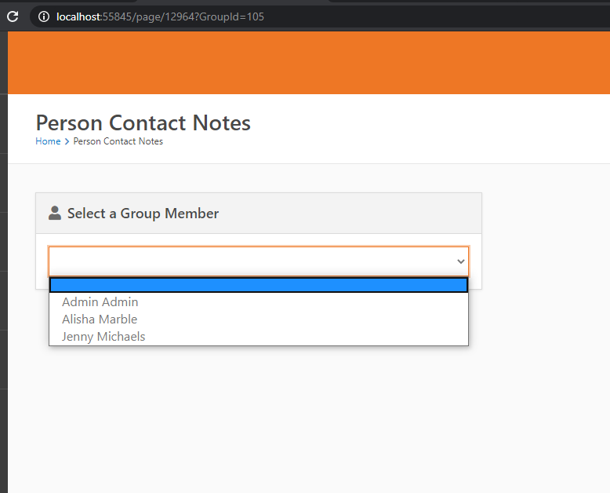
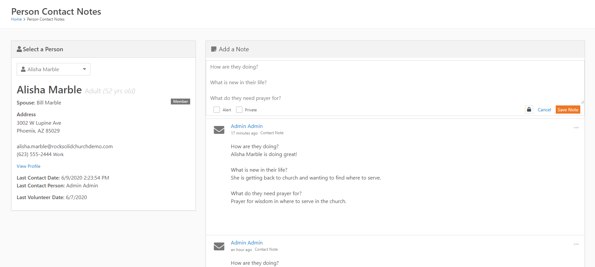
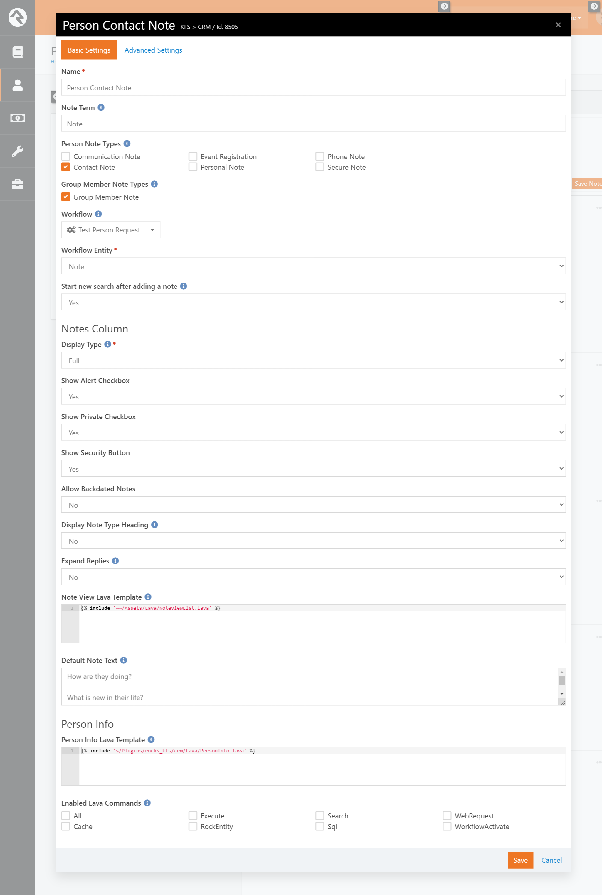

## **Person Contact Notes**

*Tested/Supported in Rock version: 10.2 (1.10.2.3)*
*Released: 6/11/2020*

This block is intended for use within the Rock internal pages to focus on contacting users with a specific note type. By default it loads a Person picker and can run with default settings as seen below. If you wish to use it with groups for specific group member notes you may pass a GroupId=### parameter in the URL.

**Person Picker:**

**Select a Group Member:**

**Person Contact Note Entry:**

**Person Contact Notes Settings:**

