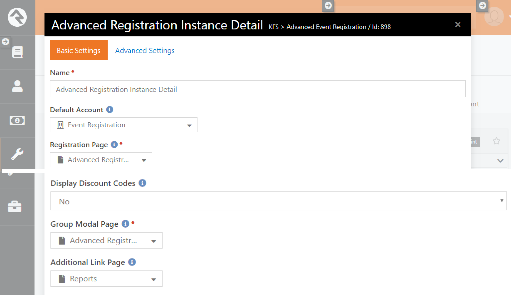

# Advanced Events<!-- omit in toc -->

## Summary <!-- omit in toc -->

Rock RMS provides an Event Registration module that covers everything from new signups, payment reminders, custom fees, to capacities and waitlists.  But for large events, the administrative work often just began.  Those events need additional resources for registrants and non-registrant volunteers, quick assignments, roster exports for breakout groups, custom group requirements, and more.   Advanced Events was designed to support those features.

Quick Links:
- [What's New](#whats-new)

- [Configuration](#configuration)

- [Usage](#usage)

- [Volunteers](#volunteers)

- [Event Resources](#event-resources)

- [Support](#support)

  <div style="page-break-after: always;"></div>
## What's New
---
You'll notice the following new items once you install this plugin:

- **New Page**: Advanced Events (Tools > Website > Advanced Events)
- **New Page**: Advanced Registration Group (Tools > Website > Advanced Events > Registration Group )
- **New Block**: Advanced Registration Instance Detail (KFS > Advanced Event Registration)
- **New Block**: Group Panel (KFS > Advanced Event Registration)
- **New Group Type**: Advanced Event Registration stores configuration for all the custom resources that registrants and non-registrant volunteers would be assigned to. 
- **New Group Type**: Event Activities is a sample group type for custom activity types. Examples include free activities (like swimming times) or fee-based activities (BMX) that require assignments. 
- **New Group Type**: Event Lodging is a sample group type for custom lodging types.  Examples include cabins, hotel rooms, or volunteer-hosted homes.
- **New Group Type**: Event Transportation is a sample group type for custom transportation types.  Examples include buses, cars, or ziplines (lucky!).
- **New Group Type**: Event Volunteers is a sample group type that allows non-registrants to be included and assigned with registrants in custom resources.
- **New Group Type Attributes**: There are several group type attributes that control how registrant assignments are displayed on the Advanced Events detail page.


## Configuration
---

Advanced Events uses core Rock functionality for parts of Event Registration, such as Event Categories and Event Templates, but you will need to use Tools > Advanced Events > Event Instance for the functionality listed below.

**Advanced Registration Instance Detail Block**

After install, the Advanced Registration Instance Detail block was added to the new Advanced Events page, under Tools > Website > Advanced Events.   Once you create an Event Category and an Event Template, you would create an Event Instance.  



```
    Name: Advanced Registration Instance Detail

	(Standard Options): All core Rock Event Registration Instance Detail block options
	
    Group Modal Page: A page containing the Group Panel block as a modal 

    Additional Link Page: Any page that you want to link with Advanced Events
    
```

**Group Panel Block**

After install, this block has been added to a child page of Advanced Event Instance Detail. This block is similar to the Group Detail block except the block can be displayed as a modal.


    Name: Advanced Event Group Detail
    
    (Standard Options): All core Rock Group Detail block options
    
    Enable Dialog Mode: Allows the Group Detail to be displayed in a modal page
    
    Show Edit: Allows the Group Detail to be edited from a modal page

**Group Type Attributes**

Advanced Events provides options for how event resources are displayed on Registrant tab and each custom resource tab.  These options are unique to each resource that inherits from the Advanced Event Registration Group Type.  Below is the default configuration from Admin Tools > General Settings > Group Types > Advanced Event Registration: 


```
    Allow Multiple Registrations: Designates whether someone can assigned to multiple groups of that type.  For example, a registrant could be assigned to take part in multiple Event Activities.  Default is False.

    Allow Volunteer Assignment: Designates whether volunteers can be assigned to a group of that type.  For example, a volunteer could be assigned to help with Event Activities, but not assigned to Event Lodging.  Default is False.

    Show On Grid: Designates whether the Registrants grid shows a quick assignment column for groups of that type. Default is False.

    Display Combined Memberships: Designates whether the resource tab displays a simple member roster for all groups of that type.  If not, each group will be shown separately with the Name, Description, Capacity, and Edit options.  Default is False.
    
    Display Separate Roles: Designates whether the resource tab displays a separate roster for each role within a group.  If not, the group roster will contain all roles.  Default is False.

```

## Usage

Once you're ready to set up an Advanced Event, you'll need to create (or update) an Event Template from Tools > Website > Advanced Events.  Configure everything as normal, except you'll choose "Advanced Event Registration" for the Event Template Group Type:


Save the Event Template, then create (or update) an Event Instance from the same page.  Everything will look the same as the core Rock Event Instance page, until you get to the bottom:


The Registration Resources section will show all of the custom resources configured for Advanced Events.  If you're a Rock administrator you'll be familiar with this pattern from Rock Check-in Configuration.

To add a custom resource to a Advanced Event, hover over the resource row until you see the ➕ button.  This will add a new tab for resources of that type to the Advanced Event Detail page.  Select a Group Requirement if you want to apply requirements to all resources of that type.  


You'll always add top-level resources from this interface, but you can add child resources here or within the resource tab of Advanced Event Detail. 

Click Save and you'll see a new tab called Activities under the Advanced Event Detail:


```Note: Rock supports an undocumented page parameter for &Tab= and a tab number.  You can use this feature to navigate directly to a tab if necessary.  Custom resource tabs typically start at the number eight.```

You'll also see a new group structure for your Advanced Event on the Group Viewer page (People > Group Viewer):


By default, Group Viewer shows all grouptypes, but you can restrict that via block settings or set up a new page solely for Advanced Event groups.


From the Advanced Event Detail page, you can add as many resources as needed for the Activity type:


Click Save, and the new Activity will be displayed beneath the resource tab:


If you configure the Group Capacity Rule for the Activity GroupType (and set group capacities), you'll see an colored indicator next to the group highlighting its capacity:


Next, add a registrant to this Advanced Event so we can assign them to the Activity.  In this screenshot we've enabled "Show On Grid" for the Event Activity grouptype:


Clicking the ➕ icon will open a new modal with details about the Registrant.  If the resource group has any Group Attributes, those will be displayed below the Note section:


Click Save, and the registrant has been assigned to the Ziplining group:


The Activities tab shows the updated capacity for Ziplining as well as roster management tools:


The Group Viewer Tree offers another option for roster management:


## Volunteers

Large events create havoc with Event Registration.  You need a ratio of volunteers balanced to the number of registrants, but the volunteers may not register in the same instance (or at all).  Now what?  Advanced Events is designed to help with that.

First, enable "Allow Volunteer Assignment" on the Event Volunteer grouptype:


Next, create a top-level group for Event Volunteers, and a child group called All Volunteers:


You can now add non-registrants to the Advanced Event from the Volunteers tab:


Click Save, and Volunteer Admin is added to the All Volunteers roster.  For this screenshot, we've enabled "Show on Grid" and "Allow Volunteer Assignment" for the Event Activity grouptype:


If you click ➕ or if you add a new membership from the Event Activity tab, you'll see a list of Registrants as well as Volunteers to choose from:


Click Save and Volunteer Admin will be added to the Ziplining roster.


## Event Resources

Hopefully your idea wheel is already rolling with ways to expand Advanced Events!  You can set up custom campus resources, weekday resources, or resources with custom requirements.  

The 🔑 for your custom resource is that it should 1) inherit from Advanced Event Registration, and 2) be listed as a child of the Advanced Event Registration grouptype. 

Here are a couple ideas to get you started: 

A) Set up an offsite event resource that needs drivers, vehicle occupancy, and driving times.  For this screenshot we've enabled the "Display Separate Roles" option for the Offsite resource grouptype:


If the resource group has numeric or boolean member attributes, a "Total" row displays with the sum of how many group members have been assigned to that attribute.

B) Set up a new resource with a custom Group Requirement that verifies the group leader is already assigned to that activity:


For this screenshot, we checked the "Move Other Registrants" option to move Ted Decker and Brian Jones into the Swimming activity at the same time.


## Support

Stay tuned for updates in the Rock Shop!  You can file a support ticket from [this link](https://www.kingdomfirstsolutions.com/Rock/Shop/Support). 