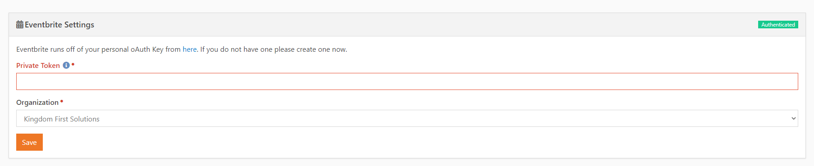
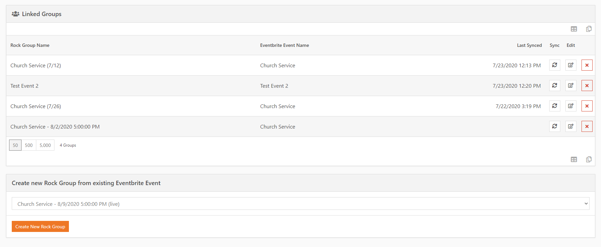
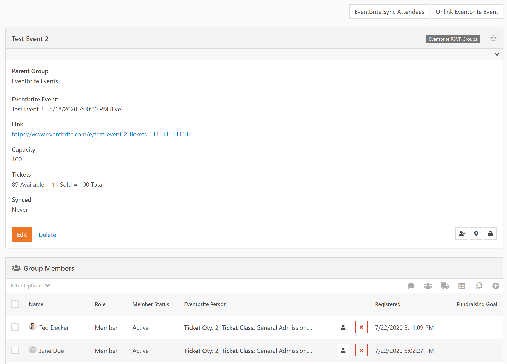

## KFS Eventbrite Integration

*Tested/Supported in Rock version: 10.2*
*Released: 7/28/2020*

This is a new set of Rock Blocks to go with our Eventbrite assembly. Our Eventbrite integration will allow you to synchronize groups with Eventbrite events. For the primary purpose of communication and pulling in new records from your Eventbrite events. This integration also allows you to use Eventbrite check-in and will pull the corresponding attendance into the linked Rock group.

**Setup**

1. Add an attribute with the field type of "Eventbrite Event" to your group type you wish to sync with (or create a new Group Type
2. Add a group member attribute with the field type of "Eventbrite Person" to the same group type.
3. Run the setup under Installed Plugins > Eventbrite
4. Register a new webhook on Eventbrite (https://www.eventbrite.com/account-settings/webhooks) to point to `https://<your rock URL>/Plugins/rocks_kfs/Eventbrite/Sync.ashx` with the "attendee.updated" action. (All other actions are currently ignored).
5. Create Groups
   1. You may now either create new groups manually within your Group Viewer page and choose an Event for the group attribute.
   2. You may set 2 Block settings on the Eventbrite settings block and it will enable the ability to import/create groups from your Eventbrite events. (On the Installed Plugins > Eventbrite page)
      1. Parent Group, you must choose a parent group to place these newly created events under.
      2. Group Type, you must also set the group type that contains the new "Eventbrite Event" attribute you created earlier.

**Eventbrite Setup:**

**Eventbrite Linked Groups:**

**Eventbrite Sync Button and Group Attribute Display:**

