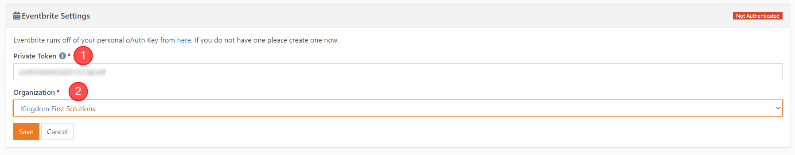
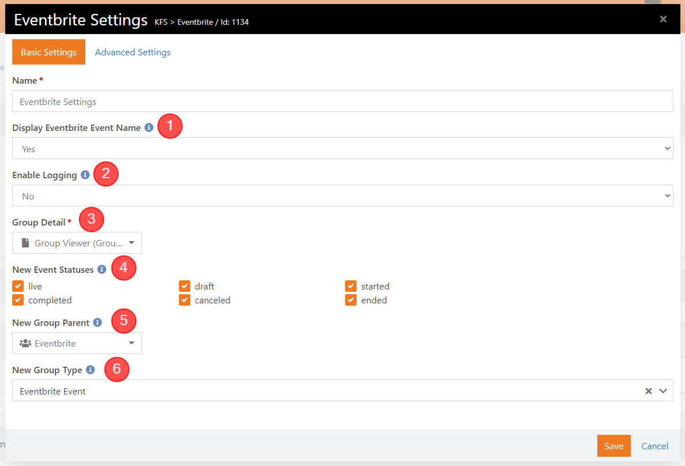
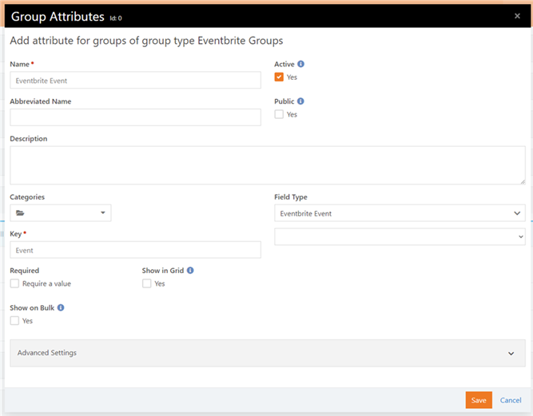
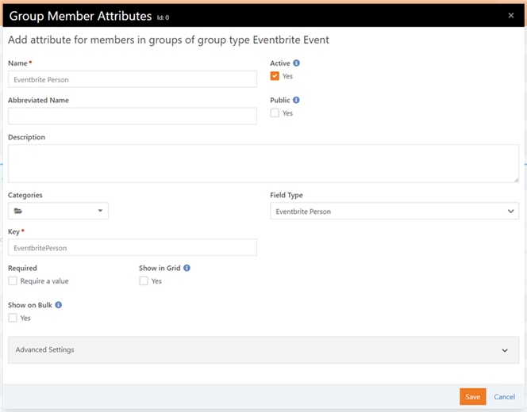
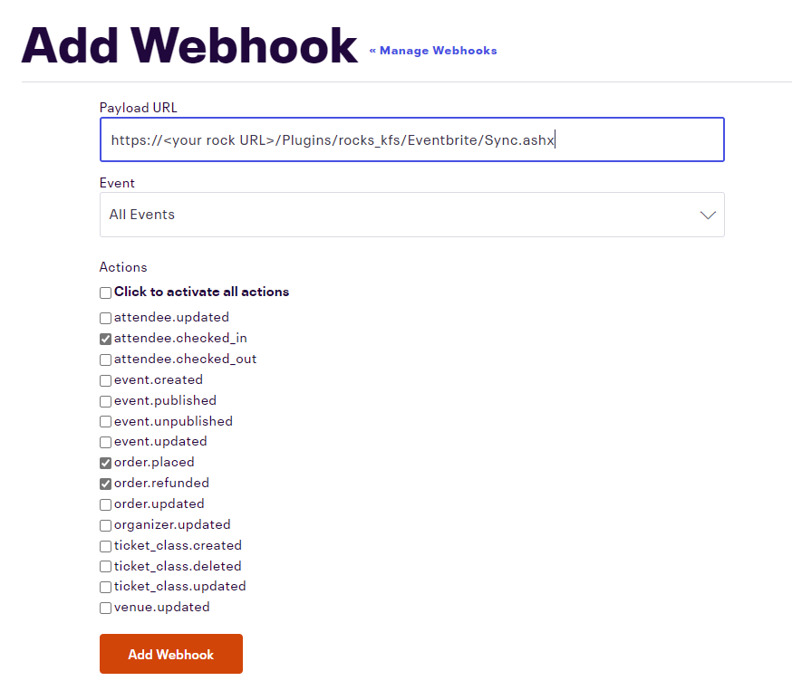
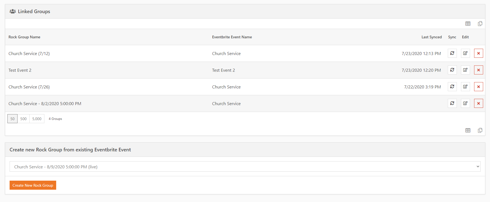

## KFS Eventbrite Integration

*Tested/Supported in Rock version: 10.2-11.2*   
*Released: 7/28/2020*

This is a new set of Rock Blocks to go with our Eventbrite assembly. Our Eventbrite integration will allow you to synchronize groups with Eventbrite events. For the primary purpose of communication and pulling in new records from your Eventbrite events. This integration also allows you to use Eventbrite check-in and will pull the corresponding attendance into the linked Rock group.

# Eventbrite Integration

## Summary

Our Eventbrite integration will allow you to synchronize groups with Eventbrite events for the primary purpose of communication and pulling in new records from your Eventbrite events. This integration also allows you to use Eventbrite check-in and will pull the corresponding attendance into the linked Rock group.

Quick Links:

- [What's New](#whats-new)
- [Configuration](#configuration)
- [Creating Groups](#creating-groups)

## What's New

---

The following new goodness will be added to your Rock install with this plugin:

- **New Page**: Eventbrite Settings (added under Admin Tools > Installed Plugins ) 
- **New Block**: Eventbrite Sync Button (added to the Group Viewer page on install) 
- **New Field Type**: Eventbrite Event
- **New Field Type**: Eventbrite Person

## Configuration

---

#### Eventbrite Settings

You will need to set up a Eventbrite API key at https://www.eventbrite.com/platform/api-keys. Then go to Admin Tools > Installed Plugins > Eventbrite Settings and enter your private token and organization.

> &nbsp;&nbsp;1 **Private Token** Enter your private token from Eventbrite.
>
> &nbsp;&nbsp;2 **Organization** After you enter your token, choose the organization associated with your Eventbrite account.

After you save your token and organization, go to the block settings and choose your New Group Parent and New Group Type. You will not be able to create groups from this block until you have set these settings.

> &nbsp;&nbsp;1 **Display Eventbrite Event Name** Display Eventbrite Event name on the grid of linked events instead of just the Event Id. (Warning, this may cause some performance issues)
>
> &nbsp;&nbsp;2 **Enable Logging** Enable logging for Eventbrite groups synced from this block. (Not recommended for day to day use)
>
> &nbsp;&nbsp;3 **Group Detail** The Group Viewer page that should be used to view the group details
>
> &nbsp;&nbsp;4 **New Event Statuses** Which event statuses from Eventbrite would you like to be available for creating new groups?
>
> &nbsp;&nbsp;5 **New Group Parent** Where new groups, if created, will be placed under. This parent group's group type must allow children of the 'New Group Type' setting below.
>
> &nbsp;&nbsp;6 **New Group Type** Group type to be used when creating new groups. The group type must have the attributes created below.

#### Group Type Attributes

You will need to set up Group Attribute on the Group Type that you want to sync with Eventbrite.

1. Go to Admin Tools > General Settings > Group Types
2. Either select the Group Type you want to use or create a new Group Type
3. Under Group Attribute, add a new attribute with a field type of Eventbrite Event
   
4. Under Member Attributes, create a new attribute with a field type of Eventbrite Person and check the Show in Grid checkbox.
   
5. Save your Group Type changes.

#### Webhook

Register a new webhook on Eventbrite (https://www.eventbrite.com/account-settings/webhooks) to point to `https://<your rock URL>/Plugins/rocks_kfs/Eventbrite/Sync.ashx` with the following actions

## Creating Groups

There are 2 ways to create Eventbrite synced groups, manually or synced through the Eventbrite Settings block.

#### Sync from Eventbrite

1. Go to Admin Tools > Installed Plugins > Eventbrite Settings.

2. In the Create new Rock Group from existing Eventbrite Event panel, choose the event you want to create a group for.

3. Click the Create New Rock Group button.

4. The new group will appear in the Linked Groups panel.
   

#### Manual Group Creation

1. Create your Eventbrite event.
2. In Rock, create a new group with your group type with the Eventbrite Attributes.
3. Under Group Attribute Values, select the Eventbrite event you want to sync to the group.
4. When you save your group, the Eventbrite Sync Attendees and Unlink Eventbrite Event buttons will appear above the group details.
5. The Eventbrite ticket details will show in the member grid.
   

#### Syncing Groups

If the Eventbrite event already has registrants before you link it to the group, **you will need to manually sync** the group. If you do not, the existing registrants will not be synced to the group. 

New registrants and Eventbrite check-in attendance will be synced automatically to the group.
