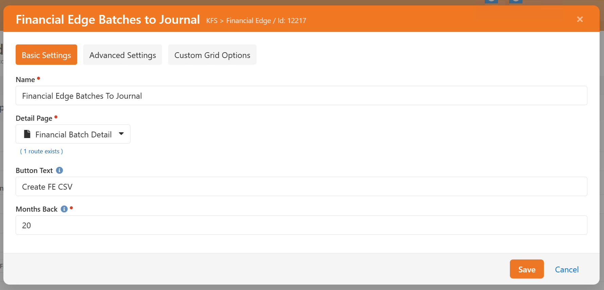

# Financial Edge Export

*Tested/Supported in Rock version: 8.0-13.0*  
*Released: 10/1/2018*   
*Updated: 2/2/2022*   

## Summary

This plug in will allow you to export batches for import into Financial Edge.

Quick Links:
- [What's New](#whats-new)
- [Configuration](#configuration)
- [Importing into Financial Edge](#importing-into-financial-edge)

## What's New
---
The following new goodness will be added to your Rock install with this plugin:

- **New Block**: Batch to Journal (added to the Batch Detail page on install) 
- **New Block**: Financial Edge Batches to Journal (added to the Financial Edge Batch Export page on install) 
- **New Account Attributes**: There are a number of new Account attributes that control where transactions are posted in Financial Edge
- **New Page**: Financial Edge Projects (Finance > Administration > Financial Edge Projects)
- **New Page**: Financial Edge Batch Export (Finance > Functions > Financial Edge Batch Export)  
- **New Defined Type**: Financial Edge Projects stores the Defined Values that designate what Project a transaction should be associated with  
- **New Batch Attribute**: Date Exported  

## Configuration
---

**Batch to Journal Block**

After install, the Batch to Journal block was added to your Batch Details page. The button will not show up until you have set the Journal Type in the block settings. The button will not be clickable if the Batch Variance amount is not $0.


```
    Name: Block name

    Button Text: Customize the text for the export button

    Journal Type: The Financial Edge Journal to post in

    Close Batch: Flag indicating if the Financial Batch should be closed in Rock when successfully exported for Financial Edge.
    
```

**Financial Projects Defined Type**

You will need to define the values for the Financial Projects defined type so the export knows what GL Project to associate accounts or transactions to in Financial Edge. We have added a new Financial Edge Projects page under Finance > Administration. This page allows you to manage Financial Edge Projects defined values without needing the RSR-Rock Admin security role.

On the Financial Edge Projects page, add a value for each of your organization's Projects. The Value must be the Financial Edge Journal Id. Description will be a friendly name for the Project.


**Account Attributes**

The export will always create (at a minimum) two lines for a Journal - a debit and a credit line. The Credit and Debit Account attributes are how this is defined.


```
    Default Project: Designates the Financial Edge Project at the account level. 

    Credit Account: Account number to be used for the credit column. Required by Financial Edge.

    Debit Account: Account number to be used for the debit column. Required by Financial Edge.

    Debit Project: Designates the Financial Edge Project for the debit account.

```

**Financial Edge Batches to Journal Page**

This page is similar to the core Batches page with the additional option of exporting multiple batches to Financial Edge at one time.

You will need to set the Journal Type for the Financial Edge Batches to Journal block settings.



```
    Name: Block name

    Detail Page: Select the Financial Batch Detail page

    Show Accounting Code: Choose whether the Accounting Code column should be displayed

    Show Accounts Column: Should the Accounts column be displayed

    Journal Type: The Financial Edge journal to post in

```

To export multiple batches to Financial Edge at one time, select the desired batches on the page and click the Create FE CSV button at the bottom of the grid


## Importing into Financial Edge

There are 2 support documents from Blackbaud that you may find helpful
- [How to import into The Financial Edge](https://kb.blackbaud.com/articles/Article/65112)
- [What are the required fields for importing journal entry transactions](https://kb.blackbaud.com/articles/Article/67013)


