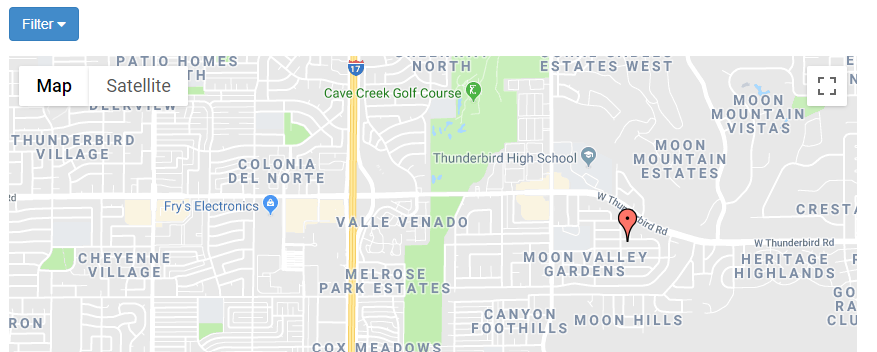
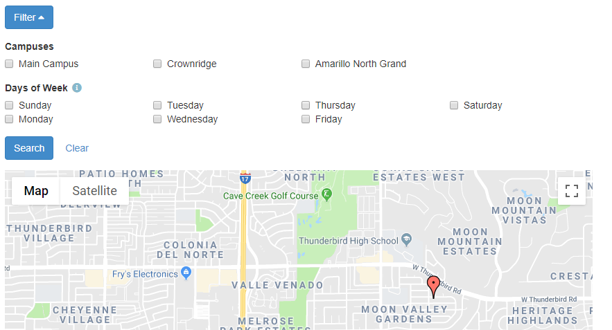
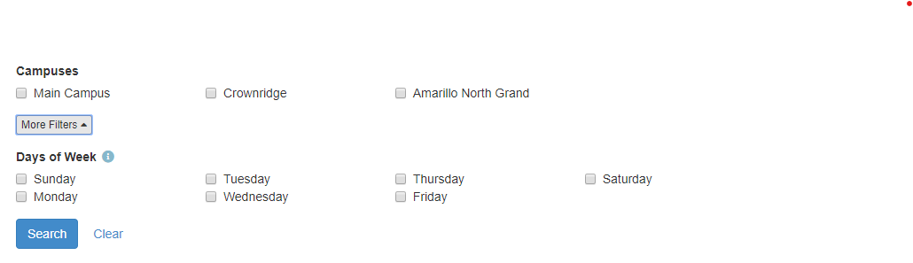
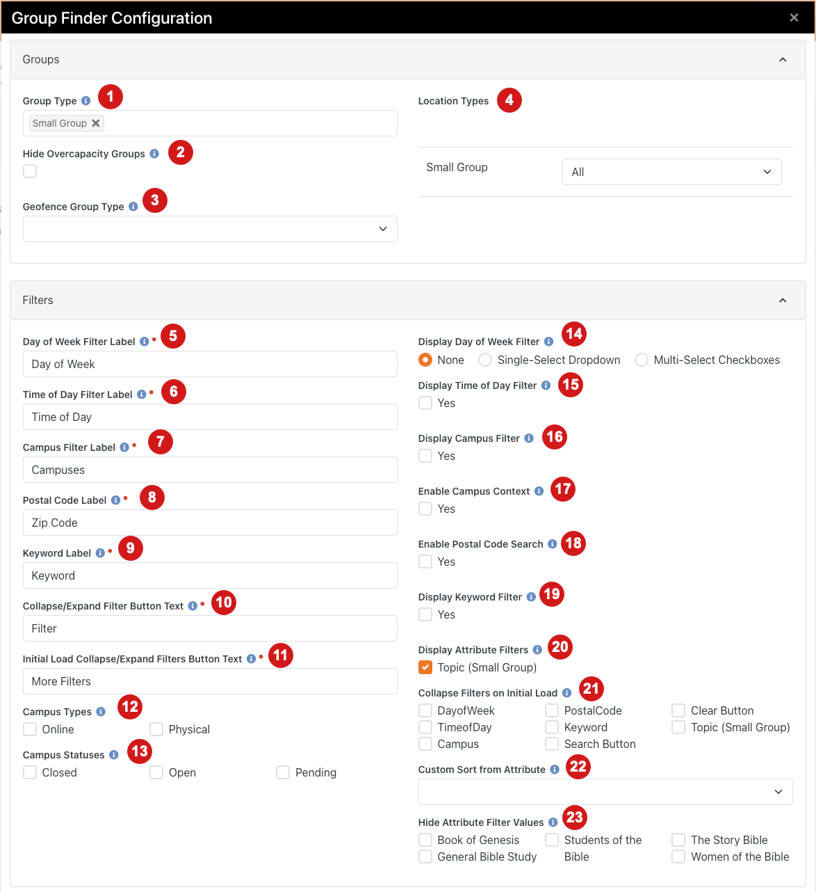
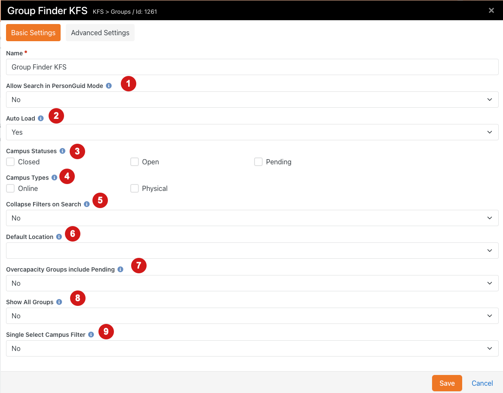

# Advanced Group Finder
*Tested/Supported in Rock version:  8.0-13.2*   
*Created:  6/8/2021*   
*Updated: 1/10/2023*   
*Rock Shop Plugin: https://www.rockrms.com/Plugin/161*

## Quick Links
- [Summary](#summary)
- [What's New](#whats-new)
- [Group Finder Configuration](#Group-Finder-Configuration)
- [Block Properties](#block-properties)

## Summary

Our Group finder is a significantly modified version of the core Rock version. Including but not limited to these features:

- Added ability to set default location so when address is enabled a campus can be selected and results auto load.
- Added single select setting so that multiselect filters will be a drop down.
- Added ability to set filters by url parameter.
- Added an override setting for PersonGuid mode that enables search options.
- Added postal code search capability.
- Added Collapsible filters.
- Added Custom Sorting based on Attribute Filter.
- Added ability to hide attribute values from the search panel.
- Added Custom Schedule Support to Day of Week Filters.
- Added Keyword search to search name or description of groups.
- Added an additional setting to include Pending members in Over Capacity checking.
- Added a setting to override groups Is Public setting to show on the finder.

**Collapsible Filters Screenshots**

  
  

## What's New

The following new goodness will be added to your Rock install with this plugin:

- **New Block** Group Finder KFS

**Note**: This block will not be added automatically to a page. You will need to create a new page or add this block to an existing page.

## Group Finder Configuration

| | |
| --- | ---- |
| 1 | **Group Type** The type of groups to look for. |
| 2 | **Hide Overcapacity Groups** When set to true, groups that are at capacity or whose default GroupTypeRole are at capacity are hidden. |
| 3 | **Geofence Group Type** An optional group type that contains groups with geographic boundary (fence). If specified, user will be prompted for their address, and only groups that are located in the same geographic boundary ( as defined by one or more groups of this type ) will be displayed. |
| 4 | **Location Types** The text above the day of the week filter. |
| 5 | **Day of the Week Filter Label** The text above the day of the week filter. |
| 6 | **Time of Day Filter Label** The text above the time of day filter. |
| 7 | **Campus Filter Label** The text above the campus filter. |
| 8 | **Postal Code Label** The text above the postal code filter. |
| 9 | **Keyword Label** The text above the keyword filter. |
| 10 | **Filter Button Text** When using collapsible filters, what the dropdown button says on it. |
| 11 | **More Filters Button Text** When using Hide Filters on Initial Load, what the dropdown button says on it. |
| 12 | **Campus Types** The campus types to filter the list of campuses on. |
| 13 | **Campus Statuses** The campus statuses to filter the list of campuses on. |
| 14 | **Display Day of Week Filter** Flag indicating if and how the Day of the Week filter should be displayed to filter groups with 'Weekly' schedules. |
| 15 | **Display Time of Day Filter** Display a Time of Day filter to filter groups with 'Weekly' schedules. |
| 16 | **Display Campus Filter** Display the campus filter. |
| 17 | **Enable Campus Context** If the page has a campus context its value will be used as a filter. |
| 18 | **Enable Postal Code Search** Set to yes to enable simple Postal code search instead of full address. |
| 19 | **Display Keyword Filter** Display the Keyword filter. |
| 20 | **Display Attribute Filters** The group attributes that should be available for user to filter results by. |
| 21 | **Collapse Filters on Initial Load** Hide these filter controls under a collapsible panel for user on first load. |
| 22 | **Custom Sort from Attribute** Select an attribute to sort by if a group contains multiple of the selected attribute filter options. |
| 23 | **Hide Attribute Filter Values** The group attribute values that you would like to hide from the filter options. This could be used to hide internal attributes used for reporting. |

(See the [Rock Your Groups Manual](https://community.rockrms.com/documentation/bookcontent/7/217#groupfinder) for the rest of the setting descriptions.)

## Block Properties

| | |
| --- | ---- |
| 1 | **Allow Search in PersonGuid Mode** When set to yes, PersonGuid mode will allow you to change filters and search in that mode for that person.  Generally used on an internal group finder page. The PersonGuid must be passed as a URL parameter. |
| 2 | **Auto Load** When set to yes, all results will be loaded to begin. |
| 3 | **Campus Statuses** Allows selecting which campus statuses to filter campuses by. |
| 4 | **Campus Types** Allows selecting which campus types to filter campuses by. |
| 5 | **Collapse Filters on Search** When set to yes, all filters will be collapsed into a single 'Filters' dropdown. |
| 6 | **Default Location** The campus address that should be used as fallback for the search criteria. |
| 7 | **Overcapacity Groups include Pending** When set to yes, the Hide Overcapacity Groups setting also takes into account pending members. |
| 8 | **Show All Groups** When set to yes, all groups will show including those where Is Public is set to false.  This is most often used on a staff internal page. |
| 9 | **Single Select Campus Filter** When set to yes, the campus filter will be a drop down instead of checkbox. |

## Advanced

**How to Set Attribute Filters via URL Parameters**

Attribute filters can be filled out using URL Parameters. If used in combination with the *Auto Load* setting, a search can be run automatically. To use this capability the parameters are in the format `filter_<attributeKey>_<fieldTypeId>=<value(s)>` (i.e. /page/236?filter_GroupCategory_16=609)

