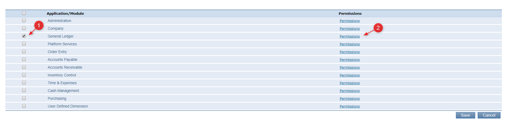
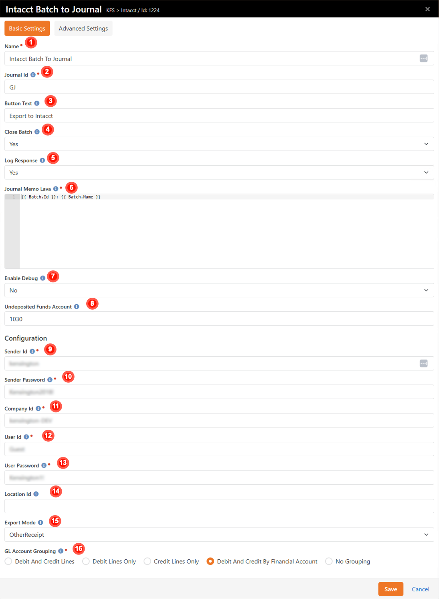
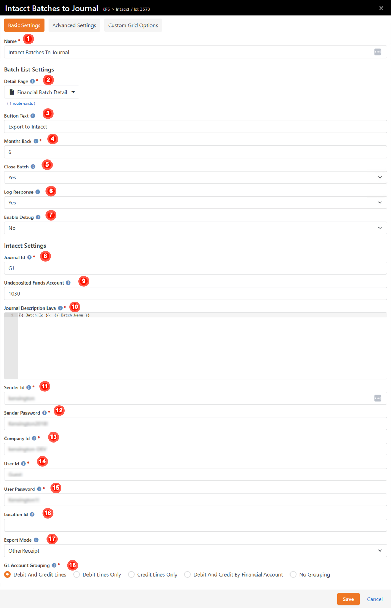
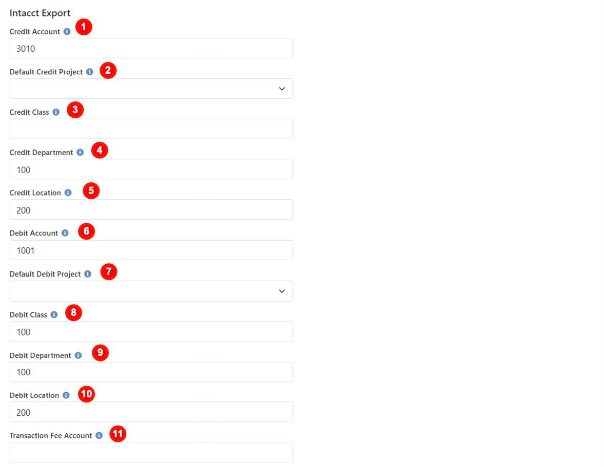
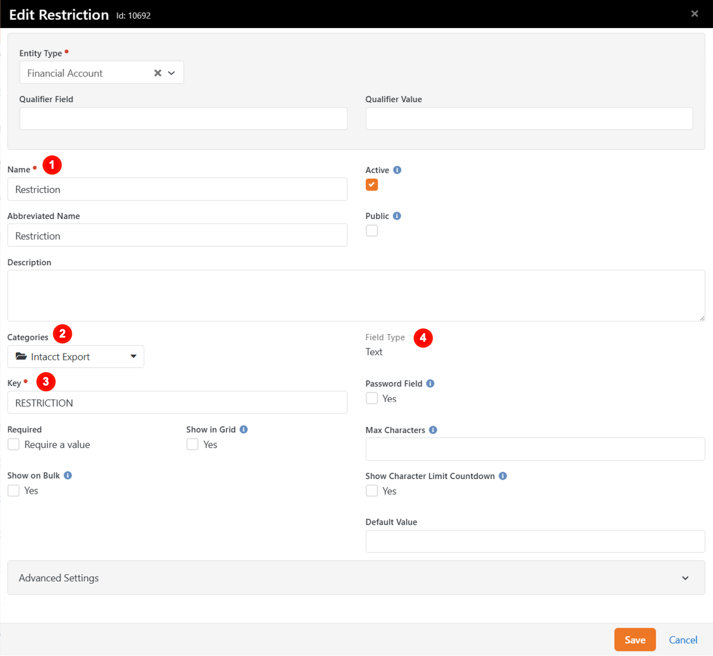

# Intacct Export to Journal 
_Tested/Supported in Rock Version:  13.0-14.0_    
_Released:  10/9/2018_   
_Updated:  8/23/2023_   

## Summary 

This plug in will allow you to create journal entries in Intacct for batches with the click of a button.

Quick Links:
- [What's New](#whats-new)
- [Configuration](#configuration)
    - [Intacct Configuration](#intacct-configuration)
    - [Rock Configuration](#rock-configuration)
- [Advanced Configuration](#advanced-configuration)

## What's New

The following new goodness will be added to your Rock install with this plugin:

- **New Page**: Intacct Projects (Finance > Administration > Intacct Projects)  
- **New Page**: Intacct Export (Finance > Functions > Intacct Export)  
- **New Block**: Batch to Journal (added to the Batch Detail Page on install)  
- **New Block**: Batches to Journal (added to the new Intacct Export Page on install)  
- **New Account Attributes**: There are a number of new Account attributes that control where transactions are posted in Intacct  
- **New Defined Type**: Financial Projects stores the Defined Values that designate what Project a Transaction should be associated with  
- **New Batch Attribute**: Date Exported 
- **New Financial Gateway Attributes:** There are 2 new Financial Gateway attributes to control how transaction fees are handled

## Configuration

There is configuration needed in Intacct. You may need to contact the Intacct Administrator for your organization for help with these steps.

<div style="page-break-after: always;"></div>

### **Intacct Configuration** 

**Create a new Role**

In Intacct, go to Company > Roles


```
    Name: API Journal
    Description: Used to make Journals via API
```
After you save the Role, the next screen will allow you to assign subscriptions to the Role



```
    Application Module: General Ledger
    Click on Permissions
```
<div style="page-break-after: always;"></div>

In the permissions window, grant All permissions for the General Ledger to the Role


```
    Select the All radio button
```
Save to close the window

Then save your changes on the Role Subscriptions page
<div style="page-break-after: always;"></div>

**Create a new User**

Note: Creating users can cost extra in Intacct. Only create a new user if there are not any existing API or generic users that you can use.

Go to Company > Admin > Users to add a user


```
    User Id: RockAPI
    Last name: API
    First name: Rock
    Email address: A valid email where you can receive the password email
    Contact name: Leave this blank to create a new contact automatically
    User name: Rock API
    User Type: Business Account
    Admin Privileges: Full
```
<div style="page-break-after: always;"></div>

**Assign User Role**

Find your new or existing API user in the Users page


```
    Click the edit link next to your API user then go to the Role Information tab
```


```
    In the blank drop down, select your API Journal Role
```
Save your changes
<div style="page-break-after: always;"></div>

**Create a new Employee**

Go to Company > Setup > Employees

Add a new Employee


```
    Primary contact name: RockAPI (or existing API user)
```


### **Rock Configuration** 

After install, the Batch to Intacct block was added to your Batch Details page to enable exporting individual batches to Intacct. Also, a new Intacct Export page containing the Batches to Intacct block added under your Finances directory to enable exporting multiple batches at once. The export button will only show up if the batch Transaction and Control amounts match.

**Batch to Journal Block**

Located on your Batch Details page, the export button will only show up if the batch Transaction and Control amounts match.


<div style="page-break-after: always;"></div>

When the block is in Other Receipts mode, you will have options for Deposit To, Payment Method and Bank Account next to the Export to Intacct button.


<div style="page-break-after: always;"></div>

You will need to configure the Batch to Journal block settings.


<div style="page-break-after: always;"></div>

| | |
| --- | ---- |
| <span style="width: 3em; height: 3em; line-height: 3em; background: #d21919; border-radius: 100%; color: white; text-align: center; display: inline-block;">1</span> | **Name** Block name. |
| <span style="width: 3em; height: 3em; line-height: 3em; background: #d21919; border-radius: 100%; color: white; text-align: center; display: inline-block;">2</span> | **Journal Id** The Intacct Symbol of the Journal that the Entry should be posted to. (example: GJ) |
| <span style="width: 3em; height: 3em; line-height: 3em; background: #d21919; border-radius: 100%; color: white; text-align: center; display: inline-block;">3</span> | **Button Text** Customize the text on the export button. |
| <span style="width: 3em; height: 3em; line-height: 3em; background: #d21919; border-radius: 100%; color: white; text-align: center; display: inline-block;">4</span> | **Close Batch** Flag indicating if the Financial Batch should be closed in Rock when successfully posted to Intacct. |
| <span style="width: 3em; height: 3em; line-height: 3em; background: #d21919; border-radius: 100%; color: white; text-align: center; display: inline-block;">5</span> | **Log Response** Flag indicating if the Intacct Response should be logged to the Batch Audit Log. |
| <span style="width: 3em; height: 3em; line-height: 3em; background: #d21919; border-radius: 100%; color: white; text-align: center; display: inline-block;">6</span> | **Journal Memo Lava** Allows you to use Lava to control what is saved in the memo column of the export. Default: {{ Batch.Id }}: {{ Batch.Name }} |
| <span style="width: 3em; height: 3em; line-height: 3em; background: #d21919; border-radius: 100%; color: white; text-align: center; display: inline-block;">7</span> | **Enable Debug** Outputs the object graph to help create your Lava syntax. |
| <span style="width: 3em; height: 3em; line-height: 3em; background: #d21919; border-radius: 100%; color: white; text-align: center; display: inline-block;">8</span> | **Undeposited Funds Account** The GL Account Id to use when Other Receipt mode is being used with Undeposited Funds option selected. |
| <span style="width: 3em; height: 3em; line-height: 3em; background: #d21919; border-radius: 100%; color: white; text-align: center; display: inline-block;">9</span> | **Sender Id** The permanent Web Services sender Id. |
| <span style="width: 3em; height: 3em; line-height: 3em; background: #d21919; border-radius: 100%; color: white; text-align: center; display: inline-block;">10</span> | **Sender Password** The permanent Web Services sender password. |
| <span style="width: 3em; height: 3em; line-height: 3em; background: #d21919; border-radius: 100%; color: white; text-align: center; display: inline-block;">11</span> | **Company Id** The Intacct company Id. This is the same information you use when you log into the Sage Intacct UI. |
| <span style="width: 3em; height: 3em; line-height: 3em; background: #d21919; border-radius: 100%; color: white; text-align: center; display: inline-block;">12</span> | **User Id** The Intacct API user Id. This is the same information you use when you log into the Sage Intacct UI. |
| <span style="width: 3em; height: 3em; line-height: 3em; background: #d21919; border-radius: 100%; color: white; text-align: center; display: inline-block;">13</span> | **User Password** he Intacct API password. This is the same information you use when you log into the Sage UI. |
| <span style="width: 3em; height: 3em; line-height: 3em; background: #d21919; border-radius: 100%; color: white; text-align: center; display: inline-block;">14</span> | **Location Id** The optional Intacct Location Id. Add a location ID to log into a multi-entity shared company. Entities are typically different locations of a single company. |
| <span style="width: 3em; height: 3em; line-height: 3em; background: #d21919; border-radius: 100%; color: white; text-align: center; display: inline-block;">15</span> | **Export Mode** Determines the type of object to create in Intacct. Selecting Journal Entry will result in creating journal entries of the type set in the Journal Id setting. Selecting Other Receipts will result in creating Other Receipts in the Cash Management area of Intacct.<br /> **NOTE:** Other Receipt mode does not support Custom Dimensions. |
| <span style="width: 3em; height: 3em; line-height: 3em; background: #d21919; border-radius: 100%; color: white; text-align: center; display: inline-block;">16</span> | **GL Account Grouping** Determines if debit and/or credit lines should be grouped and summed as follows in the resulting Intacct Journal Entry or Other Receipt:<ul><li>**Debit Accounts**: Company, Region, Super Fund, Cost Center Debit Number, Debit Account, Debit Account Sub, Fund Number, Project, Transaction Fee Account, Location, and any Custom Dimensions</li><li>**Credit Accounts**: Company, Region, Department, Super Fund, Cost Center Credit Number, Revenue Account, Revenue Account Sub, Fund Number, Project, Location, and any Custom Dimensions</li><li>**Financial Account Grouping**: Both credit and debit lines are grouped by Rock Financial Account, Project, and Transaction Fee Account.</li></ul> **NOTE:** Other Receipt mode does not support debit account grouping. |

**Batches to Journal Block**

The Batches to Journal block was added to a new page under your Finances heading named Intacct Export. It consists of a specialized grid of exportable batches with an export button at the bottom.


When the block is in Other Receipts mode, you will have options for Deposit To, Payment Method and Bank Account next to the Export to Intacct button.


<div style="page-break-after: always;"></div>

You will need to configure the Batches to Journal block settings.
<br /><br />



| | |
| --- | ---- |
| <span style="width: 3em; height: 3em; line-height: 3em; background: #d21919; border-radius: 100%; color: white; text-align: center; display: inline-block;">1</span> | **Name** Block name. |
| <span style="width: 3em; height: 3em; line-height: 3em; background: #d21919; border-radius: 100%; color: white; text-align: center; display: inline-block;">2</span> | **Detail Page** The Financial Batch Detail page. |
| <span style="width: 3em; height: 3em; line-height: 3em; background: #d21919; border-radius: 100%; color: white; text-align: center; display: inline-block;">3</span> | **Button Text** Customize the text on the export button. |
| <span style="width: 3em; height: 3em; line-height: 3em; background: #d21919; border-radius: 100%; color: white; text-align: center; display: inline-block;">4</span> | **Months Back** Number of months back that batches should be loaded. This is helpful to prevent database timeouts if there are years of historical batches. |
| <span style="width: 3em; height: 3em; line-height: 3em; background: #d21919; border-radius: 100%; color: white; text-align: center; display: inline-block;">5</span> | **Close Batch** Flag indicating if the Financial Batch should be closed in Rock when successfully posted to Intacct. |
| <span style="width: 3em; height: 3em; line-height: 3em; background: #d21919; border-radius: 100%; color: white; text-align: center; display: inline-block;">6</span> | **Log Response** Flag indicating if the Intacct Response should be logged to the Batch Audit Log. |
| <span style="width: 3em; height: 3em; line-height: 3em; background: #d21919; border-radius: 100%; color: white; text-align: center; display: inline-block;">7</span> | **Enable Debug** Outputs the object graph to help create your Lava syntax. |
| <span style="width: 3em; height: 3em; line-height: 3em; background: #d21919; border-radius: 100%; color: white; text-align: center; display: inline-block;">8</span> | **Journal Id** The Intacct Symbol of the Journal that the Entry should be posted to. (example: GJ) |
| <span style="width: 3em; height: 3em; line-height: 3em; background: #d21919; border-radius: 100%; color: white; text-align: center; display: inline-block;">9</span> | **Undeposited Funds Account** The GL Account Id to use when Other Receipt mode is being used with Undeposited Funds option selected. |
| <span style="width: 3em; height: 3em; line-height: 3em; background: #d21919; border-radius: 100%; color: white; text-align: center; display: inline-block;">10</span> | **Journal Description Lava** Allows you to use Lava to control what is saved in the memo column of the export. Default: {{ Batch.Id }}: {{ Batch.Name }} |
| <span style="width: 3em; height: 3em; line-height: 3em; background: #d21919; border-radius: 100%; color: white; text-align: center; display: inline-block;">11</span> | **Sender Id** The permanent Web Services sender Id. |
| <span style="width: 3em; height: 3em; line-height: 3em; background: #d21919; border-radius: 100%; color: white; text-align: center; display: inline-block;">12</span> | **Sender Password** The permanent Web Services sender password. |
| <span style="width: 3em; height: 3em; line-height: 3em; background: #d21919; border-radius: 100%; color: white; text-align: center; display: inline-block;">13</span> | **Company Id** The Intacct company Id. This is the same information you use when you log into the Sage Intacct UI. |
| <span style="width: 3em; height: 3em; line-height: 3em; background: #d21919; border-radius: 100%; color: white; text-align: center; display: inline-block;">14</span> | **User Id** The Intacct API user Id. This is the same information you use when you log into the Sage Intacct UI. |
| <span style="width: 3em; height: 3em; line-height: 3em; background: #d21919; border-radius: 100%; color: white; text-align: center; display: inline-block;">15</span> | **User Password** he Intacct API password. This is the same information you use when you log into the Sage UI. |
| <span style="width: 3em; height: 3em; line-height: 3em; background: #d21919; border-radius: 100%; color: white; text-align: center; display: inline-block;">16</span> | **Location Id** The optional Intacct Location Id. Add a location ID to log into a multi-entity shared company. Entities are typically different locations of a single company. |
| <span style="width: 3em; height: 3em; line-height: 3em; background: #d21919; border-radius: 100%; color: white; text-align: center; display: inline-block;">17</span> | **Export Mode** Determines the type of object to create in Intacct. Selecting Journal Entry will result in creating journal entries of the type set in the Journal Id setting. Selecting Other Receipts will result in creating Other Receipts in the Cash Management area of Intacct.<br />**NOTE:** Other Receipt mode does not support Custom Dimensions. |
| <span style="width: 3em; height: 3em; line-height: 3em; background: #d21919; border-radius: 100%; color: white; text-align: center; display: inline-block;">18</span> | **GL Account Grouping** Determines if debit and/or credit lines should be grouped and summed as follows in the resulting Intacct Journal Entry or Other Receipt:<ul><li>**Debit Accounts**: Company, Region, Super Fund, Cost Center Debit Number, Debit Account, Debit Account Sub, Fund Number, Project, Transaction Fee Account, Location, and any Custom Dimensions</li><li>**Credit Accounts**: Company, Region, Department, Super Fund, Cost Center Credit Number, Revenue Account, Revenue Account Sub, Fund Number, Project, Location, and any Custom Dimensions</li><li>**Financial Account Grouping**: Both credit and debit lines are grouped by Rock Financial Account, Project, and Transaction Fee Account.</li></ul>**NOTE:** Other Receipt mode does not support debit account grouping. |
<div style="page-break-after: always;"></div>

**Financial Projects Defined Type**

You will need to define the values for the Financial Projects defined type so the export knows what GL Project to associate accounts or transactions to in Intacct. We have added a new Intacct Projects page under Finance > Administration. This page allows you to manage Intacct Projects defined values without needing the RSR-Rock Admin security role.

On the Intacct Projects page, add a value for each of your organization's Projects. The Value must be the Intacct Journal Id. Description will be a friendly name for the Project.


**Financial Gateway Attributes**

If your financial gateway reports transaction fees to Rock in their transaction download, you may want to configure these Financial Gateway attributes to choose how those fees are sent to Intacct.


| |
| --- |
| **Gateway Fee Processing** How should the Intacct Export plugin process transaction fees? DEFAULT: No special handling of transaction fees will be performed. NET DEBIT: Add credit entries for any transaction fees and use net amount (amount - transaction fees) for debit account entries. GROSS DEBIT: Debit account entries are left untouched (gross) and new debit and credit entries will be added for any transaction fees. NOTE: Both Net Debit and Gross Debit require a Fee Account attribute be set on either the financial gateway or financial account. |
| **Default Fee Account** Default account number for transaction fees. |
<div style="page-break-after: always;"></div>

**Account Attributes**

The export will always create (at a minimum) two lines for a Journal - a debit and a credit line. The Credit and Debit Account attributes are how this is defined.

In addition to the Intacct Dimensions included, custom Dimensions can also be added.

Most organizations will mark the GL Project designation by setting a default Project on an account in Rock. If more specific Project marking is needed, the export utility also created a Financial Transaction Detail Attribute that allows for designation at the gift level.


<div style="page-break-after: always;"></div>

| | |
| --- | ---- |
| <span style="width: 3em; height: 3em; line-height: 3em; background: #d21919; border-radius: 100%; color: white; text-align: center; display: inline-block;">1</span> | **Credit Account** Account number to be used for the credit column. Required by Intacct. |
| <span style="width: 3em; height: 3em; line-height: 3em; background: #d21919; border-radius: 100%; color: white; text-align: center; display: inline-block;">2</span> | **Default Credit Project** Designates the project for the assigned Credit Account at the financial account level. |
| <span style="width: 3em; height: 3em; line-height: 3em; background: #d21919; border-radius: 100%; color: white; text-align: center; display: inline-block;">3</span> | **Credit Class** The Intacct dimension for Class Id to be used for assigned Credit Account. |
| <span style="width: 3em; height: 3em; line-height: 3em; background: #d21919; border-radius: 100%; color: white; text-align: center; display: inline-block;">4</span> | **Credit Department** The Intacct dimension for Department Id to be used for assigned Credit Account. |
| <span style="width: 3em; height: 3em; line-height: 3em; background: #d21919; border-radius: 100%; color: white; text-align: center; display: inline-block;">5</span> | **Credit Location** The Intacct dimension for Location Id to be used for assigned Credit Account. Required if multi-entity enabled. |
| <span style="width: 3em; height: 3em; line-height: 3em; background: #d21919; border-radius: 100%; color: white; text-align: center; display: inline-block;">6</span> | **Debit Account** Account number to be used for the debit column. Required by Intacct. |
| <span style="width: 3em; height: 3em; line-height: 3em; background: #d21919; border-radius: 100%; color: white; text-align: center; display: inline-block;">7</span> | **Default Debit Project** Designates the project for the assigned Debit Account at the financial account level. |
| <span style="width: 3em; height: 3em; line-height: 3em; background: #d21919; border-radius: 100%; color: white; text-align: center; display: inline-block;">8</span> | **Debit Class** The Intacct dimension for Class Id to be used for assigned Debit Account. |
| <span style="width: 3em; height: 3em; line-height: 3em; background: #d21919; border-radius: 100%; color: white; text-align: center; display: inline-block;">9</span> | **Debit Department** The Intacct dimension for Department Id to be used for assigned Debit Account. |
| <span style="width: 3em; height: 3em; line-height: 3em; background: #d21919; border-radius: 100%; color: white; text-align: center; display: inline-block;">10</span> | **Debit Location** The Intacct dimension for Location Id to be used for assigned Debit Account. Required if multi-entity enabled. |
| <span style="width: 3em; height: 3em; line-height: 3em; background: #d21919; border-radius: 100%; color: white; text-align: center; display: inline-block;">11</span> | **Transaction Fee Account** Expense account number for gateway transaction fees. |

<div style="page-break-after: always;"></div>

## Advanced Configuration

### **Adding Custom Dimension Example**

- Go to Admin Tools > System Settings > Entity Attributes
- In the filter options, set the Entity Type to Financial Account
- Add a new Attribute



| | |
| --- | ---- |
| <span style="width: 3em; height: 3em; line-height: 3em; background: #d21919; border-radius: 100%; color: white; text-align: center; display: inline-block;">1</span> | **Name** Restriction |
| <span style="width: 3em; height: 3em; line-height: 3em; background: #d21919; border-radius: 100%; color: white; text-align: center; display: inline-block;">2</span> | **Categories** Intacct Export |
| <span style="width: 3em; height: 3em; line-height: 3em; background: #d21919; border-radius: 100%; color: white; text-align: center; display: inline-block;">3</span> | **Key** RESTRICTION |
| <span style="width: 3em; height: 3em; line-height: 3em; background: #d21919; border-radius: 100%; color: white; text-align: center; display: inline-block;">4</span> | **Field Type** Text |

### **Important Information about Your Custom Dimension**
- Custom Dimensions are currently not supported for Other Receipts.
- The Name is for internal (Rock) purposes only
- The Category has to be set to the Intacct Export category in order to be included in the API post
- The Key is the actual Intacct specific name of the Custom Dimension in all caps. Also, you'll notice that the core KFS Dimensions use the format `rocks.kfs.Intacct.CLASSID`. The custom key can be anything you'd like, so long as there is a period before the Dimension name. For example, `org.mychurch.Intacct.MYCUSTOMDIM` is a valid Attribute Key. The plugin will automatically prepend `GLDIM` to the front of your Dimension name to ensure compatibility with the Sage Intacct api.
- Text attributes are recommended for the Custom Dimensions. However, the value you enter in the attribute on the Financial Account must be the System Info > ID, not the text value. (i.e. Value: MT-Event-P1234, ID: 10005. You must enter 10005 in Rock.)
- Debit and/or Credit specific dimensions are also supported. Simply add `_DEBIT` or `_CREDIT` to the end of the Rock key for the referenced dimension to be only applied to credit or debit grouping respectively. If no suffix is added, the dimension will be used for both debit and credit grouping. The plugin will automatically remove the suffix from your Dimension name to ensure compatibility with the Sage Intacct api.

**Examples:**
- *Custom Dimension 1:*
  - Record Name: Restriction
  - Integration Name: restriction
  - Rock Key: RESTRICTION
- *Custom Dimension 2:*
  - Record Name: Custom Project
  - Integration Name: custom_project
  - Rock Key: CUSTOM_PROJECT
- *Custom Dimension 2 Value:*
  - Custom Project: MT - Event - P1234
  - ID: 10005
  - Rock Value: 10005


<style>
  table {
    background-color: rgba(220, 220, 220, 0.4);
  }
  th {
    display: none;
  }
</style>