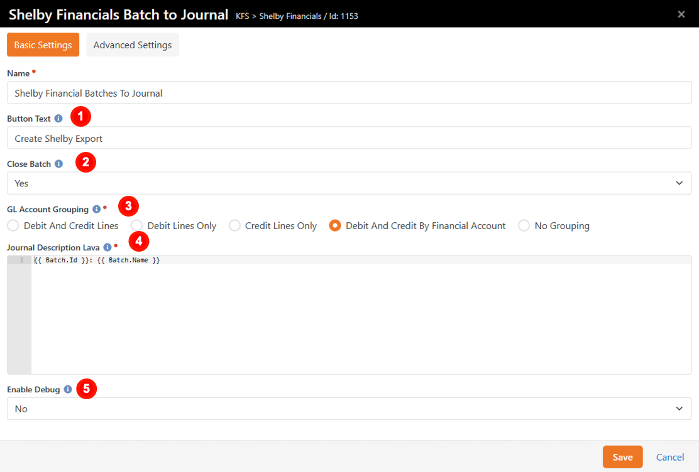
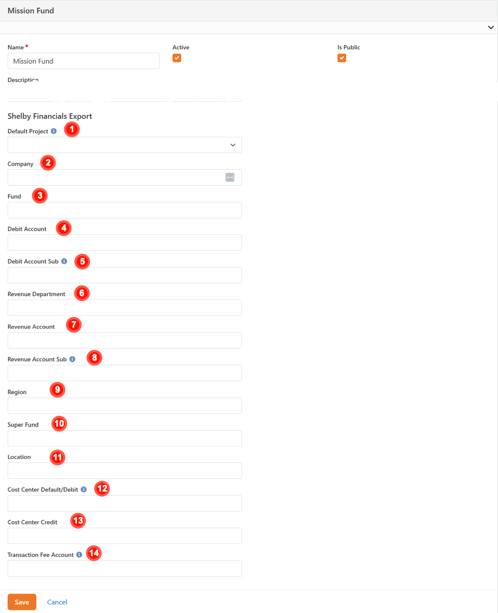

# Shelby Financials Export
*Tested/Supported in Rock version:  8.0-14.0*   
*Created:  10/29/2018*  
*Updated:  5/11/2023*   
*Rock Shop Plugin: https://www.rockrms.com/Plugin/97*

## Summary

Quick Links:
- [What's New](#whats-new)
- [Configuration](#configuration)
- [Exporting to Shelby Financials](#exporting-to-shelby-financials)

## What's New

- The following new goodness will be added to your Rock install with this plugin:
  - **New Block**: Shelby Financials Batch to Journal (added to the Batch Detail page on install) 
  - **New Block**:  Shelby Financials Batches to Journal (added to the Shelby GL Batch Export page on install) 
  - **New Account Attributes**: There are a number of new Account attributes that control where transactions are posted in Shelby Financials
  - **New Transaction Attribute**: Transaction Project
  - **New Page**: Projects (Finance > Administration > Projects)
  - **New Page**: Shelby GL Export (Finance > Functions > Shelby GL Export)  
  - **New Defined Type**: Financial Projects stores the Defined Values that designate what Project a transaction or batch should be associated with  
  - **New Batch Attribute**: Date Exported  

## Configuration

#### Batch to Journal Block

After install, the Shelby Financials Batch to Journal block was added to your Batch Details page. 

| | |
| --- | ---- |
| 1 | **Button Text** Customize the text on the export button |
| 2 | **Close Batch** Control whether the batch gets marked as closed in Rock after export |
| 3 | **GL Account Grouping** Determines if debit and/or credit lines should be grouped and summed as follows in the export file:<ul><li>**Debit Accounts**: Company, Region, Super Fund, Cost Center Debit Number, Debit Account, Debit Account Sub, Fund Number, Project, Transaction Fee Account, and Location</li><li>**Credit Accounts**: Company, Region, Department, Super Fund, Cost Center Credit Number, Revenue Account, Revenue Account Sub Account, Fund Number, Project, and Location</li><li>**Financial Account Grouping**: Both credit and debit lines are grouped by Rock Financial Account, Project, and Transaction Fee Account.</li></ul> |
| 4 | **Journal Description Lava** Lava for the journal description column per line. Default: Batch.Id: Batch.Name |
| 5 | **Enable Debug** Outputs the object graph to help create your Lava syntax |

#### Shelby Financials Batches to Journal Block

| | |
| --- | ---- |
| 1 | **Detail Page** Link to the Financial Batch Details page |
| 2 | **Button Text** Customize the text for the export button |
| 3 | **Months Back** Number of months back that batches should be loaded. This is helpful to prevent database timeouts if there are years of historical batches |
| 3 | **GL Account Grouping** Determines if debit and/or credit lines should be grouped and summed as follows in the export file:<ul><li>**Debit Accounts**: Company, Region, Super Fund, Cost Center Debit Number, Debit Account, Debit Account Sub, Fund Number, Project, Transaction Fee Account, and Location</li><li>**Credit Accounts**: Company, Region, Department, Super Fund, Cost Center Credit Number, Revenue Account, Revenue Account Sub Account, Fund Number, Project, and Location</li><li>**Financial Account Grouping**: Both credit and debit lines are grouped by Rock Financial Account, Project, and Transaction Fee Account.</li></ul> |
| 5 | **Journal Description Lava** Lava for the journal description column per line. Default: Batch.Id: Batch.Name |
| 6 | **Enable Debug** Outputs the object graph to help create your Lava syntax |

#### Account Attributes

The export will always create (at a minimum) two lines for a Journal - a debit and a credit line. The Credit and Debit Account attributes are how this is defined. Each of these attributes will need to be set to the Id of the option in your Shelby Financials GL. Only the Attributes that are filled in will be exported.

| | |
| --- | ---- |
| 1 | **Default Project** Designates the project at the financial account level |
| 2 | **Company** Designates the company |
| 3 | **Fund** Designates the fund |
| 4 | **Debit Account** Account number to be used for the debit column |
| 5 | **Debit Account Sub** Designates the Debit Account sub |
| 6 | **Revenue Department** Designates the department |
| 7 | **Revenue Account** Account number to be used for the credit column |
| 8 | **Revenue Account Sub** Designates the Revenue Account sub |
| 9 | **Region** Designates the region |
| 10 | **Super Fund** Designates the super fund |
| 11 | **Location** Designates the location |
| 12 | **Cost Center Default/Debit** Cost Center Default will be used on both Credit/Debit lines if Cost Center Credit does not contain a value |
| 13 | **Cost Center Credit** Designates the cost center for credits |
| 14 | **Transaction Fee Account** Expense account number for gateway transaction fees |

#### Financial Gateway Attributes

If your financial gateway reports transaction fees to Rock in their transaction download, you may want to configure these Financial Gateway attributes to choose how those fees are handled in your export file.

| | |
| --- | ---- |
| 1 | **Gateway Fee Processing** How should the Intacct Export plugin process transaction fees?<ul><li>**Default**: No special handling of transaction fees will be performed.</li><li>**Net Debit**: Add credit entries for any transaction fees and use net amount (amount - transaction fees) for debit account entries.</li><li>**GrossDebit**: Debit account entries are left untouched (gross) and new debit and credit entries will be added for any transaction fees.NOTE: Both Net Debit and Gross Debit require a Fee Account attribute be set on either the financial gateway or financial account.</li></ul> |
| 2 | **Default Fee Account** The default account number for transaction fees. |

#### Projects Defined Type

You may want to define the values for the Financial Projects defined type so the export knows what GL Project to associate accounts or transactions to in Shelby Financials. We have added a new Projects page under Finance > Administration. This page allows you to manage  Projects defined values without needing the RSR-Rock Admin security role.

On the Projects page, add a value for each of your organization's Projects. The Value must be the Id from Shelby Financials. Description will be a friendly name for the Project.

## Exporting to Shelby Financials

#### Assigning Projects

You can assign Projects to a financial account, a transaction or to a specific amount in the transaction.

**To assign a Project to an account**, you will set an [account attribute](#account-attributes).

**To assign a Project to an entire transaction**, select the Transaction Project from the dropdown list when you create the transaction. To assign a project to an existing transaction, edit the transaction and choose a Project from the dropdown list.

**To assign a Project to part of a transaction**, as you add the accounts and amounts to the transaction, select the Project from the dropdown list. You can also a project by editing the accounts on an existing transaction.

#### Exporting Single Batches

On the Batch Detail page, select the Journal Type and enter an Accounting Period for the batch then click the Create Shelby Export button. You will not be able to export a batch if the variance amount is not $0.

#### Exporting Multiple Batches

To export multiple batches, go to the Shelby GL Export page (Finance > Functions > Shelby GL Export). Select the batches you wish to export, select a Journal Type, enter an Accounting Period and click the Create Shelby Export button.

