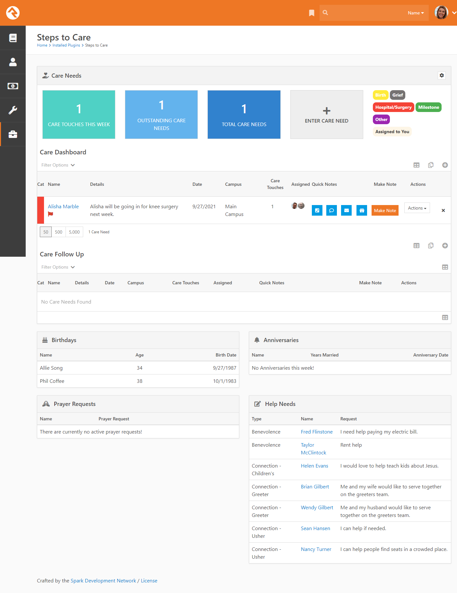
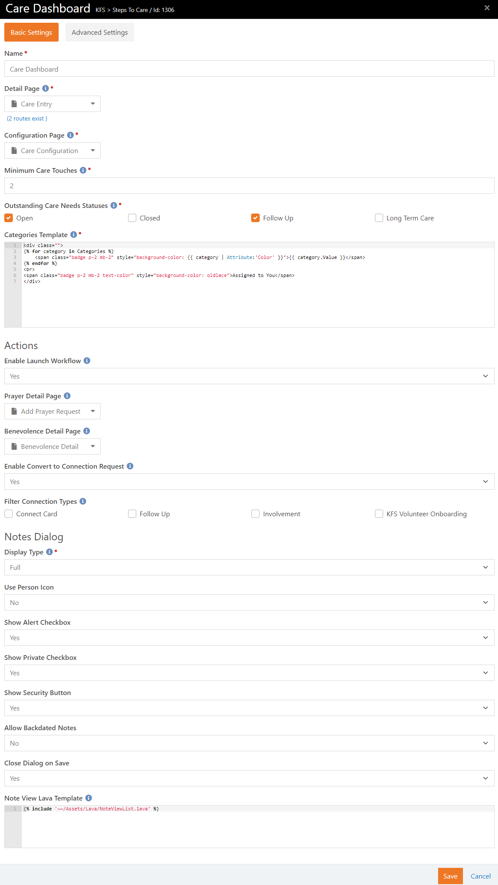
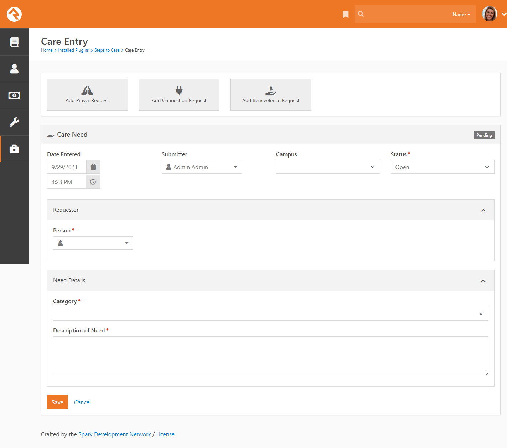
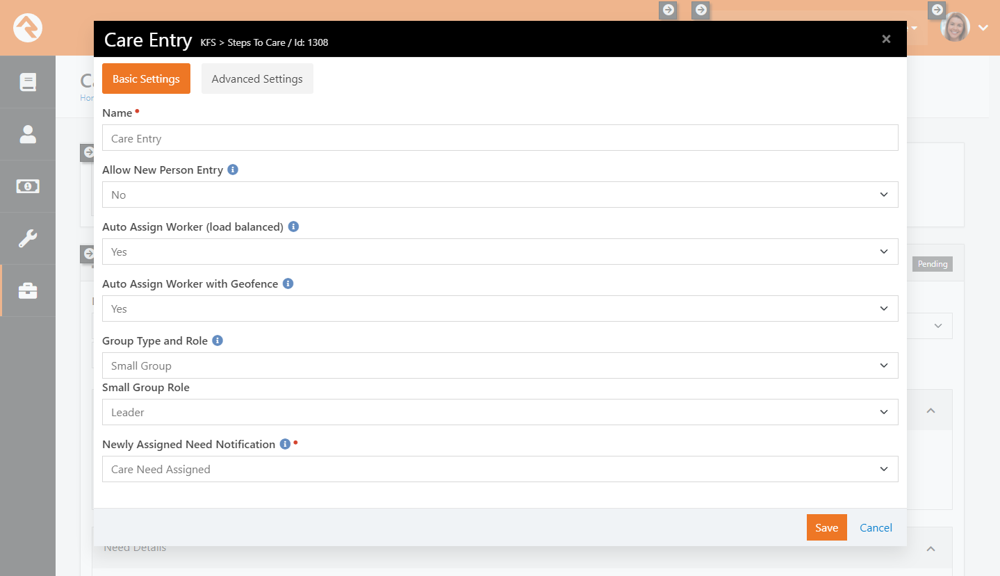
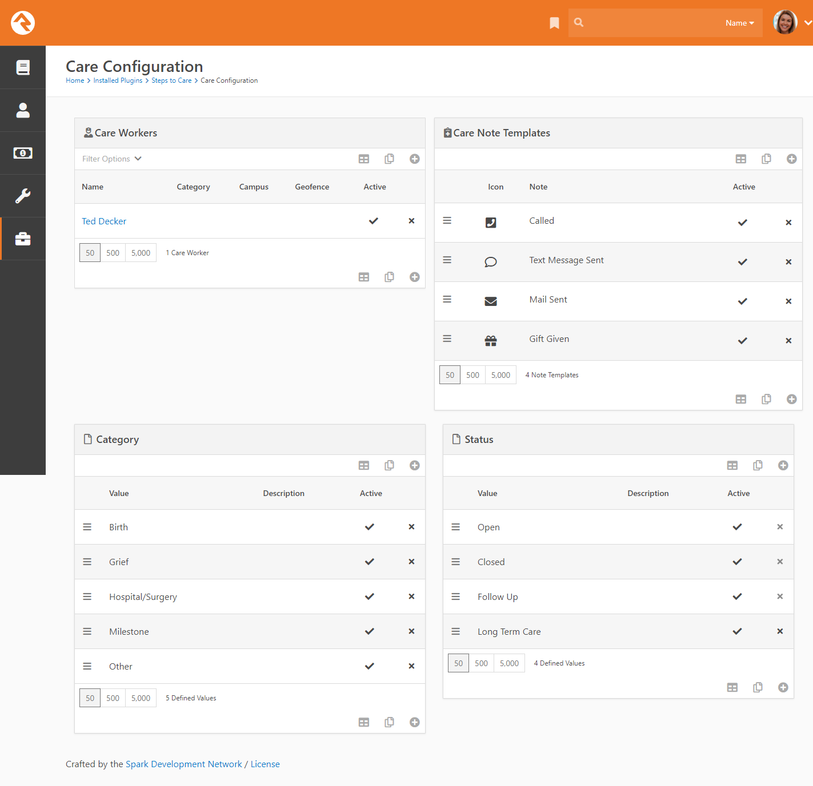
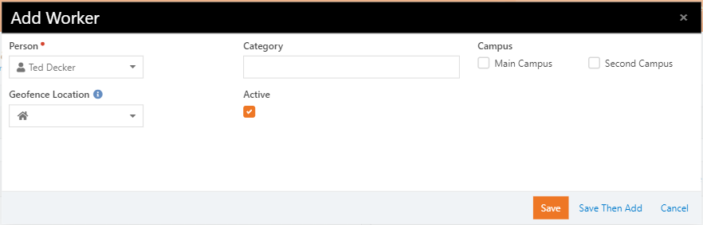
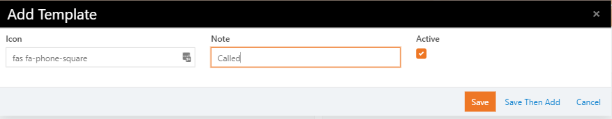
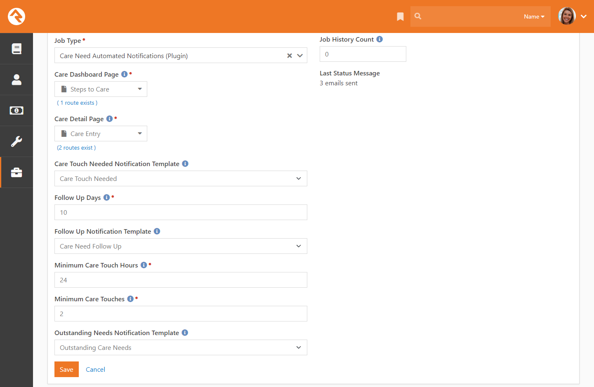

# Steps To Care
*Tested/Supported in Rock version:  12.3-12.5  
*Created:  9/30/2021*  
*Rock Shop Plugin: https://www.rockrms.com/Plugin/#*

## Summary

Steps to Care is a new take on pastoral care based on how Rock Springs Church does their process.

**Quick Links:**

- [What's New](#whats-new)
- [Dashboard Configuration](#dashboard-configuration)
- [Care Entry Configuration](#care-entry-configuration)
- [Care Configuration](#care-configuration)
- [Job Configuration](#job-configuration)

## What's New

The following new goodness will be added to your Rock install with this plugin:

- Steps to Care will be installed under "Installed Plugins" > "Steps to Care"

## Dashboard Configuration

> &nbsp;&nbsp;1&nbsp;&nbsp; **Detail Page** The Care Entry page, in case it gets moved or you setup an additional set of pages.

## Care Entry Configuration

> &nbsp;&nbsp;1&nbsp;&nbsp; **Allow New Person Entry** Should you be able to enter a new person from the care entry form and use person matching?

## Care Configuration

> &nbsp;&nbsp;1&nbsp;&nbsp; **Care Workers** Add Care workers here for "round-robin" style automatic assignment or add a GeoFence worker (using a named location GeoFence), to auto assign based on GeoFence.

> &nbsp;&nbsp;1&nbsp;&nbsp; **Person** Select a person in  your system to be assigned as a Care Worker.

> &nbsp;&nbsp;1&nbsp;&nbsp; **Icon** Font awesome CSS class for the icon. This will be displayed on the dashboard for a "Quick Note"

## Job Configuration

> &nbsp;&nbsp;1&nbsp;&nbsp; **Care Dashboard Page** This will be the link that populates the "LinkedPages.CareDashboardPage" lava variable in each of the provided system communication templates.